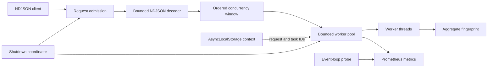

# Node Reliability Lab

[](https://github.com/wasiliy-strecker/node-reliability-lab/actions/workflows/ci.yml)

[](LICENSE)

Production-minded Node.js runtime patterns for backpressure, worker isolation, async
context, cancellation, observability, and graceful shutdown.

This repository starts from failure modes that appear in long-running services. It uses
Node core APIs directly so framework behavior cannot hide queue growth, event-loop stalls,
lost request context, or incomplete shutdown.

## Start here

| Operational problem                                  | Implementation                                                                               | Behavioral proof                                            |
| ---------------------------------------------------- | -------------------------------------------------------------------------------------------- | ----------------------------------------------------------- |
| A producer outruns downstream work and grows memory  | [`decodeNdjson`](src/streams/ndjson.ts) and [`mapConcurrent`](src/streams/map-concurrent.ts) | Chunk-boundary, limit, ordering, and bounded-prefetch tests |
| CPU work blocks every request on the event loop      | [`BoundedWorkerPool`](src/workers/bounded-worker-pool.ts)                                    | Worker-isolation scenario and real worker tests             |
| Parallel tasks lose their correlation metadata       | [`RequestContextStore`](src/context/request-context.ts) plus `AsyncResource`                 | Overlapping-context and worker-boundary tests               |
| Queues accept more work than the process can finish  | Fixed worker and queue capacity plus HTTP admission control                                  | Saturation returns `503` with `Retry-After`                 |
| A deployment kills accepted requests halfway through | [`ShutdownCoordinator`](src/lifecycle/shutdown-coordinator.ts)                               | Real HTTP drain and child-process `SIGTERM` tests           |

The integrated example is an NDJSON event fingerprinting service. Its CPU workload is
deliberately deterministic, making the runtime behavior reproducible without claiming that
fingerprinting itself is a product.

## Architecture



The HTTP process parses only bounded lines. Canonicalization and repeated hashing happen in
worker threads. An accepted request pulls at most its configured concurrency window from the
source, so downstream capacity controls upstream reading.

See [architecture](docs/architecture.md) for ownership and shutdown order.

## Quick start

Requirements are Node.js 22.15 or newer and pnpm 11. The primary runtime is Node.js 24 LTS.

```bash
pnpm install --frozen-lockfile
pnpm verify
pnpm start
```

In another shell:

```bash
curl --data-binary @fixtures/events.ndjson \
  --header 'content-type: application/x-ndjson' \
  --header 'x-request-id: local-demo' \
  http://127.0.0.1:3000/v1/events
```

The response contains the trusted request ID, record count, normalized byte count, an aggregate
fingerprint, and observed duration.

```json
{
  "requestId": "local-demo",
  "processed": 3,
  "normalizedBytes": 453,
  "fingerprint": "…",
  "durationMs": 12.4
}
```

Operational endpoints:

- `GET /health/live` confirms that the process is alive.
- `GET /health/ready` returns `503` as soon as draining begins.
- `GET /metrics` exposes dependency-free Prometheus text metrics.
- `POST /v1/events` accepts `application/x-ndjson`.

## Executable scenarios

```bash
pnpm scenario
```

The scenario runner demonstrates three relationships:

1. Synchronous CPU work prevents a main-thread heartbeat while worker execution leaves it alive.
2. Streaming never advances beyond the configured processing window.
3. The real HTTP service processes data and releases its server, probe, and workers.

Timings are observations from the current machine. CI checks semantic invariants, not fragile
throughput thresholds.

## Runtime contracts

| Component         | Guarantee                                                                               | Deliberate boundary                                                           |
| ----------------- | --------------------------------------------------------------------------------------- | ----------------------------------------------------------------------------- |
| NDJSON decoder    | Body, line, and record counts are bounded before more data is accepted                  | It validates transport shape, not an organization-wide event schema           |
| Concurrent map    | At most `concurrency` mapper calls and source items are in flight                       | Ordered output may wait behind one slow earlier item                          |
| Worker pool       | Active plus queued work never exceeds configured capacity                               | Capacity is local to one process, not a distributed quota                     |
| Cancellation      | Queued work stops immediately and CPU work observes a shared cooperative flag           | A blocking native call cannot be forcibly interrupted in place                |
| Worker crash      | The active task fails and the worker is replaced                                        | The task is not retried because partial side effects are unknowable           |
| Request context   | Context survives promises, callbacks, and explicit worker transfer                      | `AsyncLocalStorage` does not cross worker or process boundaries automatically |
| Graceful shutdown | Readiness changes before acceptance stops, then admitted work drains until the deadline | A process cannot guarantee delivery to an external system it does not own     |

Read the [failure-mode catalog](docs/failure-modes.md) before reusing a primitive. The
[runtime decision guide](docs/runtime-decision-guide.md) explains when a simpler design is safer.

## Configuration

| Variable                   |                  Default | Purpose                                             |
| -------------------------- | -----------------------: | --------------------------------------------------- |
| `HOST`                     |              `127.0.0.1` | Listen address                                      |
| `PORT`                     |                   `3000` | Listen port, with `0` allowed for tests             |
| `WORKER_COUNT`             | CPU-aware, capped at `4` | Fixed number of worker threads                      |
| `WORKER_QUEUE_SIZE`        |       `WORKER_COUNT * 2` | Maximum queued worker tasks                         |
| `MAX_CONCURRENT_REQUESTS`  |                      `2` | HTTP ingestion admission slots                      |
| `PER_REQUEST_CONCURRENCY`  |                Up to `2` | Records processed concurrently per accepted request |
| `FINGERPRINT_ROUNDS`       |                    `256` | Deterministic CPU work per event                    |
| `MAX_BODY_BYTES`           |               `10485760` | Maximum raw request bytes                           |
| `MAX_LINE_BYTES`           |                  `65536` | Maximum bytes in one NDJSON line                    |
| `MAX_RECORDS`              |                  `10000` | Maximum records per request                         |
| `SHUTDOWN_GRACE_PERIOD_MS` |                  `10000` | Total graceful shutdown budget                      |

Startup rejects capacity settings where all admitted requests could exceed worker and queue
capacity. This turns an operational contradiction into an immediate configuration error.

## Verification

```bash
pnpm format:check
pnpm lint
pnpm typecheck
pnpm test:coverage
pnpm scenario:smoke
```

The test suite uses Node's native test runner and real worker threads, TCP listeners, disconnects,
worker crashes, and process signals. Coverage thresholds are enforced. CI runs the complete suite
on Node.js 22, 24, and 26.

## Repository layout

```text
node-reliability-lab/
├── src/app/            Node core HTTP service and metrics
├── src/context/        AsyncLocalStorage request context
├── src/lifecycle/      Phased shutdown coordination
├── src/observability/  diagnostics_channel and event-loop probes
├── src/streams/        Bounded NDJSON and concurrent mapping
├── src/workers/        Worker protocol, runtime, and fixed pool
├── src/scenarios/      Executable runtime demonstrations
├── test/               Unit, integration, worker, and process tests
└── docs/               Architecture and decision records
```

## What this repository does not claim

- Worker threads do not make asynchronous network I/O faster.
- Backpressure is not durable storage.
- A bounded in-memory queue is not a message broker.
- Graceful shutdown is not exactly-once processing.
- Request context is correlation metadata, not authentication.
- The scenario runner is not a cross-machine benchmark.
- No experimental Node.js API is part of the implementation.

## Related portfolio projects

- [FlowForm Studio](https://github.com/wasiliy-strecker/flowform-studio) applies React, NestJS,
  WebSockets, durable publication, and browser reconciliation in a complete product.
- [typed-policy-kit](https://github.com/wasiliy-strecker/typed-policy-kit) shares typed authorization
  semantics between React and Express while keeping the server authoritative.
- [Java Concurrency Lab](https://github.com/wasiliy-strecker/java-concurrency-lab) covers virtual
  threads, bounded downstream resources, and fail-fast fan-out. This repository is intentionally
  about Node's event loop, streams, workers, and process lifecycle instead.

## License

Copyright 2026 Wasiliy Strecker. Licensed under the [Apache License 2.0](LICENSE).
