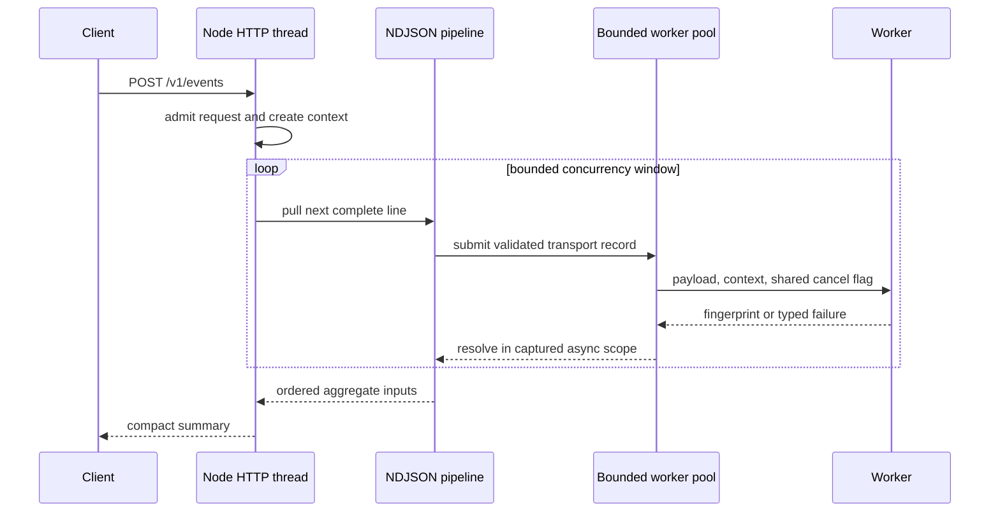
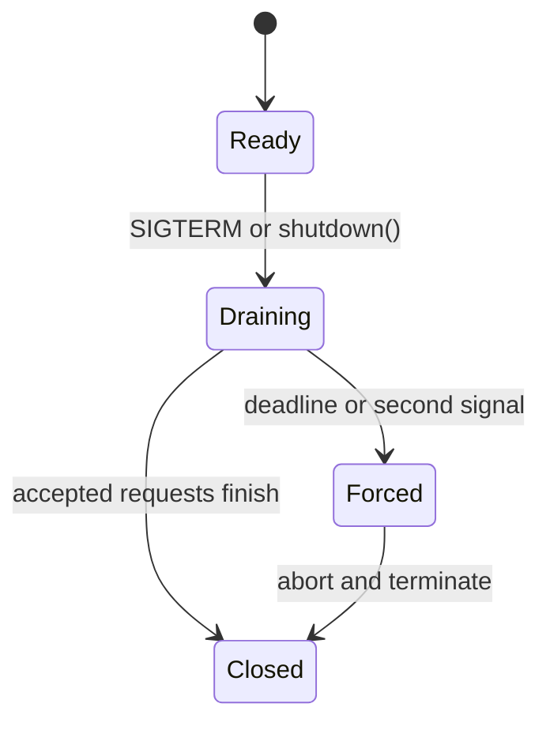

# Architecture

## Runtime boundary

One Node.js process owns the HTTP listener, request admission, stream parsing, metrics, shutdown
state, and a fixed set of worker threads. No module silently creates a second pool or process-wide
singleton. The application constructs every stateful resource and closes it in reverse dependency
order.



## Backpressure and capacity

`decodeNdjson` emits one record at a time and never buffers more than one bounded partial line.
`mapConcurrent` pulls at most its configured concurrency from that decoder. The worker pool admits
only `workerCount + maxQueue` tasks. Finally, HTTP admission limits the number of ingestion
pipelines that may compete for those slots.

Configuration enforces this relationship:

```text
MAX_CONCURRENT_REQUESTS × PER_REQUEST_CONCURRENCY
    ≤ WORKER_COUNT + WORKER_QUEUE_SIZE
```

The inequality does not promise latency. It prevents the server from accepting more immediate
pipeline work than its explicitly owned capacity can represent.

## Context boundary

`AsyncLocalStorage` associates request metadata with promise and callback continuations on the main
thread. `AsyncResource` associates worker task settlement with the submitting async scope. Worker
threads are separate isolates, so the serializable request context travels in the task protocol and
is installed in a worker-local context store.

Context contains correlation metadata only. Authentication and authorization must use trusted,
explicit inputs rather than ambient logging context.

## Cancellation boundary

An `AbortSignal` rejects queued work immediately. For active CPU work, the pool writes a flag into a
`SharedArrayBuffer`. Worker code checks that flag at bounded intervals and throws a typed abort.

This is cooperative cancellation. JavaScript running a long native operation cannot process a
message event, and Node cannot safely interrupt arbitrary code inside an isolate. Shutdown may
terminate an entire worker after the grace period, but it never describes that as ordinary task
cancellation.

## Shutdown order



The coordinator executes three graceful phases:

1. Mark readiness false and stop accepting new connections.
2. Drain connections and already accepted requests.
3. Close the now-idle worker pool and runtime probe.

If any phase fails, the deadline expires, or a second signal arrives, the root signal aborts and
every resource receives a force callback. The reusable coordinator returns a result instead of
calling `process.exit`, leaving exit-code policy to the executable entrypoint.

## Failure ownership

- Invalid transport or event input belongs to the request and returns a bounded problem response.
- Capacity exhaustion is expected control flow and returns `503` with `Retry-After`.
- A worker failure rejects only its active task. A replacement handles future work.
- Unknown server failures are logged with correlation metadata while clients receive no stack.
- Shutdown timeout produces a non-zero process exit code after resources are forced closed.
